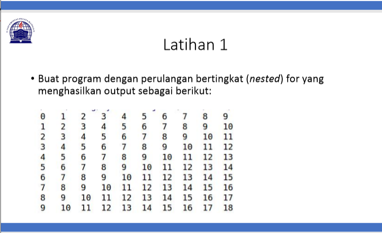
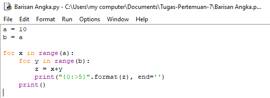
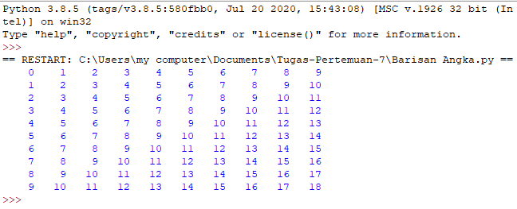
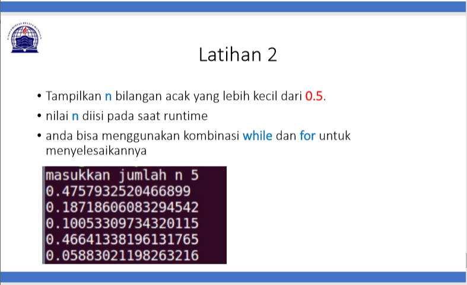
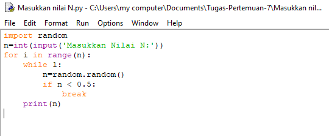
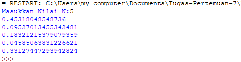

# Tugas Pertemuan 7

Nama : Bangkit Akbar Anggara 
NIM : 312010148 
Kelas : TI.20.B.1 

# Tugas Pertemuan 7 - Latihan 1
Jadi pada pertemuan ini saya diberikan beberapa tugas oleh dosen saya yaitu diantaranya:

Pada tugas pertama, saya diminta untuk membuat sebuah program pengulangan bertingkat yang nantinya akan menghasilkan output seperti gambat diatas.
Untuk bisa dapat menghasilkan output tersebut maka saya memasukan syntax:

Keterangan :
 - untuk dapat melakukan pengulangan bertingkat kamu perlu memasukan for
 - karena pada syntax tersebut kamu membutuhkan a(baris) dan b(kolom) jadi kamu perlu menambahkan keterangan a(baris) dan b(kolom) sebelum menggunakan for

Jika sudah memasukan semua syntax diatas dan telah di run, maka kamu akan mendapatkan tampilan seperti gambar yang ada dibawah ini :

# Tugas Pertemuan 7 - Latihan 2
Di tugas ke dua, saya diminta untuk mencari nilai acak yang bernominal dibawah 0,5.

Berikut ini adalah syntax yang saya gunakan:

Keterangan:
 - Saya menggunakan syntax random.random yang digunakan untuk mencari nilai random
 - Sementara n=int(input('')) untuk menentukan jumlah input yang diinginkan oleh kita
 
Jika sudah memasukan semua syntax diatas dan telah di run, maka kamu akan mendapatkan tampilan seperti gambar yang ada dibawah ini:

Untuk Tugas Pertemuan 7 suda selesai, lanjut ke Tugas Pertemuan 7 - Praktikum 2

# ===Bangkit Akbar Anggara===
# ===Thank You===
